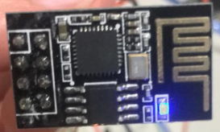

# BME280_exporter
Exposing BME280 metrics with ESP8266-01, so a Prometheus server can scrape it

---
The BME280 Sensor and ESP8266 used to write this code are the ones showed on the images below:

 

At the [Prototyping section](#Prototyping) I'm using a diferente bme280 just because I couldn't find the right one.

## Prototyping

If you have an arduino board, you can power both BME280 and ESP8266 with the Arduino Board and wire ESP's `RX` and `TX` with arduino to use the Monitor Serial.

If you don't have you can still use external power supply and just leave ESP's `RX` and `TX` open.

## Setting up Prometheus

This repository also provides a [docker-compose](docker-compose.yml) file so you can easly deploy a Prometheus Server using [Docker](https://docs.docker.com/compose/install/)

The docker-compose will deploy the services:

* [Prometheus](http://localhost:9091)
* [Alertmanager](http://localhost:9094)
* [Grafana](http://localhost:3001)

> Notice that the Alertmanager send alerts to a non-existent Webhook. Feel free to change it's configuration that best suits your needs or develop a Webserver that can receive these alerts and do something about it.